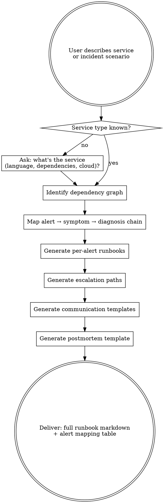

# Incident Runbook Generator

## Overview

This skill generates actionable incident runbooks from service descriptions. It doesn't just
produce generic "check the logs and restart" advice — it encodes diagnosis patterns, dependency
chains, blast-radius estimation, rollback procedures, and communication templates that on-call
engineers need during 3 AM incidents.

---

## Decision Flow



---

## Quick Reference

| Incident type | First check | Common cause | Quick mitigation |
|--------------|-------------|-------------|------------------|
| High latency (p95 > 1s) | DB connection pool, downstream timeout | Slow queries, connection exhaustion | Increase pool size, circuit-break downstream |
| Error rate spike (5xx) | Recent deploy? (check `kubectl rollout history`) | Bad config, unhandled edge case | `kubectl rollout undo` |
| OOMKilled | Memory graph in Grafana | Memory leak, traffic spike | Increase limits (temporary), restart, find leak |
| CrashLoopBackOff | `kubectl logs --previous` | Missing env/secret, config parse error | Fix ConfigMap, restart |
| DB connection exhausted | `SHOW PROCESSLIST` / `pg_stat_activity` | Connection leak, slow queries | Kill idle connections, check pool config |
| TLS cert expired | `kubectl describe certificate` | cert-manager not renewing | Manual renew, check ClusterIssuer |
| Queue depth growing | Consumer lag metric | Consumer down or slow | Scale consumers, check DLQ |

---

## Workflow: Generating a Runbook

### Step 1 — Gather Service Context

**Required:**
- Service name and what it does
- Language / framework
- Cloud provider and deployment platform (EKS, GKE, Lambda, EC2...)

**Infer from context, ask only if ambiguous:**
- Upstream dependencies (databases, caches, queues, other services)
- Downstream consumers (who calls this service?)
- Observability stack (Prometheus+Grafana, Datadog, New Relic, CloudWatch)
- On-call rotation / alerting channels (PagerDuty, Slack, Opsgenie)

**Optional (offer to include):**
- SLO/SLI definitions
- Capacity planning numbers (expected QPS, max QPS)
- Known failure modes from past incidents

### Step 2 — Build Dependency Graph

Map every dependency and categorize failure impact:

```
service-name
├── upstream (service depends on these)
│   ├── PostgreSQL (critical: service can't serve without it)
│   ├── Redis (degraded: cache miss → slower but functional)
│   └── Auth Service (critical: can't validate tokens)
├── downstream (these depend on service)
│   ├── API Gateway → routes to service
│   └── Frontend → calls service for data
└── infrastructure
    ├── EKS cluster (us-east-1)
    ├── AWS RDS (us-east-1a)
    └── ElastiCache (us-east-1a)
```

### Step 3 — Map Alerts to Runbooks

| Alert | Symptom | Severity | Runbook section |
|-------|---------|----------|----------------|
| `HighErrorRate` | 5xx > 1% for 5min | P1 | § Error Rate Spike |
| `HighLatency` | p95 > 500ms for 10min | P2 | § High Latency |
| `HighCPUUsage` | CPU > 80% for 10min | P2 | § Resource Saturation |
| `HighMemoryUsage` | Memory > 85% for 10min | P2 | § Memory Pressure |
| `InstanceDown` | Health check failing for 2min | P1 | § Instance Down |
| `CertExpiring` | TLS cert < 7 days to expiry | P3 | § TLS Renewal |
| `DBConnectionPoolExhausted` | Active connections > 80% of max | P1 | § DB Connection Exhaustion |
| `QueueDepthHigh` | Queue > 1000 messages for 10min | P2 | § Queue Backlog |

---

## Runbook Template

Each runbook section follows this structure:

### Section Structure

```markdown
## <Incident Title>

**Severity:** P1 / P2 / P3
**Alert:** <Alert name from monitoring>
**Slack channel:** #incident-<service>
**Runbook owner:** <team>

### 1. Triage (First 2 Minutes — DON'T SKIP)

Before touching anything, answer:
- [ ] Is there a recent deploy? (`kubectl rollout history deployment/<name>`)
- [ ] Is there an active cloud provider incident? (AWS/GCP status page)
- [ ] Are dependent services healthy? (Check their dashboards)
- [ ] What changed? (Infra change, config change, traffic pattern?)

### 2. Diagnosis

#### Step 2a: Check service health
```bash
kubectl get pods -l app=<name> -n <namespace>
kubectl describe pod <pod-name> -n <namespace>
```

#### Step 2b: Check recent logs
```bash
kubectl logs -l app=<name> -n <namespace> --tail=200 --since=10m | grep -iE "error|panic|fatal|timeout"
```

#### Step 2c: Check resource usage
```bash
kubectl top pod -l app=<name> -n <namespace>
```

#### Step 2d: Check downstream dependencies
```bash
# Database connectivity
kubectl exec -it deploy/<name> -n <namespace> -- nc -zv <db-host> 5432

# Check DB connection pool metrics in Grafana
# Dashboard: <link-to-dashboard>
```

#### Common root causes (ranked by likelihood):
1. Recent deploy introduced regression → **Action:** Rollback
2. Downstream dependency degraded → **Action:** Check dependency status page
3. Traffic spike → **Action:** Scale up
4. Resource leak (memory, connections) → **Action:** Restart + open bug
5. Infrastructure issue (node failure, network partition) → **Action:** Escalate to infra team

### 3. Mitigation

#### Immediate (stop the bleeding):
- [ ] Rollback: `kubectl rollout undo deployment/<name> -n <namespace>`
- [ ] Scale up: `kubectl scale deployment/<name> --replicas=<N> -n <namespace>`
- [ ] Circuit break downstream: set `DOWNSTREAM_TIMEOUT=2s` and restart
- [ ] Drain traffic: `kubectl cordon <node>` if node-level issue

#### If rollback fails:
1. Check DB migration compatibility (new code → old schema might break)
2. Force restart: `kubectl rollout restart deployment/<name> -n <namespace>`
3. Last resort: Scale to 0 and redeploy known-good image tag

### 4. Verification

- [ ] Error rate returned to baseline (< 0.1%)
- [ ] Latency p95 returned to < 300ms
- [ ] All pods running and passing readiness probe
- [ ] Downstream dependencies confirmed healthy
- [ ] Smoke test passed: `curl -s https://api.example.com/health`

### 5. Communication

#### Internal (post in #incident-<service>):
```
🚨 INCIDENT: <title> — <severity>
Status: <investigating | mitigated | resolved>
Start: <timestamp>
Impact: <what users see>
Mitigation: <what was done>
Next: <next steps>
```

#### External (if user-facing):
Copy from status page template (see communication-templates section below).

### 6. Postmortem Follow-up

- [ ] Create bug ticket for root cause fix
- [ ] Update this runbook if diagnosis missed something
- [ ] Add metric/alert if this was detected late
- [ ] Schedule postmortem meeting (< 24h for P1, < 1 week for P2)
```

---

## Incident-Specific Runbooks

### Error Rate Spike (5xx > Threshold)

```markdown
**Additional diagnosis:**
```bash
# Check which endpoint returning errors
kubectl logs -l app=<name> -n <namespace> --tail=500 | grep -E " 5[0-9]{2} " | awk '{print $7}' | sort | uniq -c | sort -rn

# Check for slow upstream calls
kubectl exec -it deploy/<name> -n <namespace> -- wget -O /dev/null -o /dev/null --timeout=5 http://<upstream>/health
```

**DB-specific:**
```sql
-- Check active connections
SELECT count(*) FROM pg_stat_activity WHERE state = 'active';

-- Check running queries > 5 seconds
SELECT pid, now() - pg_stat_activity.query_start AS duration, query, state
FROM pg_stat_activity
WHERE (now() - pg_stat_activity.query_start) > interval '5 seconds';
```
```

### High Latency (p95 > Threshold)

```markdown
**Additional diagnosis:**
```bash
# Check DB query performance
kubectl exec -it deploy/<name> -n <namespace> -- wget -qO- "http://<db-metrics-exporter>/metrics" | grep query_duration

# Check GC behavior (for JVM/Go)
kubectl exec -it deploy/<name> -n <namespace> -- wget -qO- "http://localhost:9090/metrics" | grep gc_pause

# Check Redis latency
redis-cli --latency -h <redis-host>
```

**Common causes:**
1. DB slow query under load → Check DB CPU, slow query log
2. Cache miss storm → Check Redis hit rate, TTL settings
3. GC pause (Java) → Check heap size, GC settings
4. Network saturation → Check node network metrics
```

### Memory Pressure (OOMKilled / High Memory)

```markdown
**Additional diagnosis:**
```bash
# Check recent OOMKilled events
kubectl get events -n <namespace> --sort-by='.lastTimestamp' | grep OOMKilled

# Check current memory usage
kubectl top pod -l app=<name> -n <namespace>

# Check memory over time from metrics
# Grafana: <link-to-memory-dashboard>
```

**Immediate mitigation:**
```bash
# Bump memory limit (temporary relief)
kubectl patch deployment <name> -n <namespace> -p '{"spec":{"template":{"spec":{"containers":[{"name":"<name>","resources":{"limits":{"memory":"<2x>"}}}]}}}}'
```

**Common causes:**
1. Memory leak → Restart recovers memory? Tends to grow over time?
2. Traffic spike → More requests = more memory
3. Large payload → Check max request size, streaming vs buffering
```

### Instance Down

```markdown
**Additional diagnosis:**
```bash
# Pod not scheduled
kubectl describe pod <pod-name> -n <namespace> | grep -A10 Events

# Node issues
kubectl describe node <node-name> | grep -A5 Conditions
kubectl top node

# Image pull issues
kubectl describe pod <pod-name> -n <namespace> | grep -i "pull"
```

**Common causes:**
1. Node under disk/memory pressure → Pod evicted
2. Image registry unreachable → ImagePullBackOff
3. Resource request > any node capacity → Pending indefinitely
4. Readiness probe failing → Pod running but not in Service endpoints
```

### Queue Backlog Growing

```markdown
**Additional diagnosis:**
```bash
# Check consumer group lag
kubectl exec -it deploy/<consumer> -n <namespace> -- kafka-consumer-groups --bootstrap-server <broker> --group <group> --describe

# Check DLQ size
kubectl exec -it deploy/<consumer> -n <namespace> -- kafka-console-consumer --bootstrap-server <broker> --topic <dlq-topic> --from-beginning --timeout-ms 5000 | wc -l
```

**Mitigation:**
1. Scale consumers: `kubectl scale deployment <consumer> --replicas=<N>`
2. Check for poison messages in DLQ (message format change?)
3. Check consumer error rate — are messages being retried and failing?
```

---

## Escalation Paths

Always generate an escalation table:

| Escalation level | Role | When to escalate | Contact |
|-----------------|------|-----------------|---------|
| L1: On-call engineer | Current rotation | First responder | PagerDuty: <schedule> |
| L2: Service owner | <Team lead> | Not resolved in 30 min | Slack: @<lead> |
| L3: Engineering manager | <Manager> | Not resolved in 60 min OR user-facing impact | Phone: <number> |
| Infra team | Infrastructure | Cloud provider / network / node issues | PagerDuty: <infra-schedule> |
| DB team | Database | DB performance / replication issues | Slack: #db-help |
| Security team | SecOps | Data breach, DDoS, credential leak | PagerDuty: <security-schedule> |

---

## Communication Templates

### Incident Start (#incident-<service>)

```
🚨 INCIDENT STARTED — <title>
Severity: P1/P2/P3
Incident Commander: @<name>
Start: <HH:MM UTC>
Impact: <service> returning 5xx for <X>% of requests. Users seeing <symptom>.
Investigating: checking recent deploys and downstream health.
Link: <incident-doc-url>
```

### Status Update (every 30 min for P1, every 1h for P2)

```
📊 UPDATE — <title> (+<N>min)
Status: Still investigating / Mitigating
Current theory: <what we think is happening>
Action taken: <what we tried>
Result: <did it help?>
Next: <next step>
```

### Incident Resolved

```
✅ RESOLVED — <title>
Duration: <N> minutes
Impact: <concrete description of user impact>
Root cause: <brief>
Mitigation: <what stopped the bleeding>
Follow-up: <ticket link> — postmortem scheduled <date>
Thank you @<helpers> for assistance.
```

---

## Postmortem Template

```markdown
# Postmortem: <Incident Title>

**Date:** YYYY-MM-DD
**Duration:** <N> minutes (HH:MM - HH:MM UTC)
**Severity:** P1 / P2
**Incident Commander:** @<name>
**Status:** Draft / Reviewed / Published

## Summary
One paragraph: what happened, what was the impact, how was it fixed.

## Timeline (UTC)
| Time | Event |
|------|-------|
| 14:32 | Alert fired: HighErrorRate > 1% |
| 14:34 | On-call acknowledged |
| 14:38 | Identified bad config deploy as cause |
| 14:41 | Rollback initiated |
| 14:44 | Error rate normalized |

## Root Cause
Why did this happen? What was the underlying cause?

## Impact
- <N> users affected
- <N> 5xx errors served
- <N> minutes of degraded service

## What Went Well
- Alert fired within 2 minutes of error rate increase
- Rollback was fast and effective
- Communication in #incident channel was timely

## What Could Be Better
- Deploy pipeline lacked canary stage that would have caught this
- Runbook was missing DB migration rollback step
- Monitoring didn't cover the specific endpoint that failed

## Action Items
- [ ] Add canary deploy stage to pipeline (#TICKET-1)
- [ ] Add endpoint-level error rate alert (#TICKET-2)
- [ ] Update runbook with DB migration rollback steps (#TICKET-3)
```

---

## Output Format

When delivering a runbook, always provide:

1. **Service context summary** (architecture, dependencies, SLIs)
2. **Alert-to-runbook mapping table**
3. **Per-incident runbooks** (following the template above)
4. **Escalation paths** (tailored to the service's team structure)
5. **Communication templates** (Slack messages for start/update/resolved)
6. **Postmortem template** (ready to copy-paste into incident doc)
