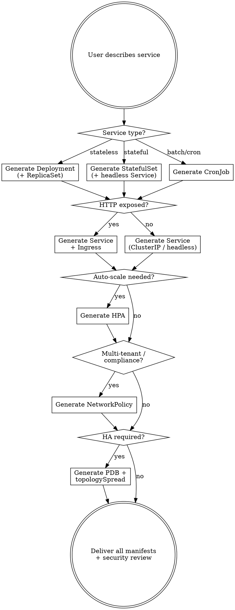

# K8s Manifest Generator

## Overview

This skill generates production-grade Kubernetes manifests. It doesn't just produce
syntactically valid YAML — it encodes security hardening, reliability patterns, resource
management, and networking best practices that prevent production incidents.

---

## Decision Flow



---

## Quick Reference

| Resource | When to generate | Key fields to always include |
|----------|-----------------|------------------------------|
| Deployment | Stateless services | `replicas`, `strategy.rollingUpdate`, `resources`, `livenessProbe`, `readinessProbe` |
| StatefulSet | Databases, queues, stateful apps | `serviceName`, `volumeClaimTemplates`, `podManagementPolicy: Parallel` |
| CronJob | Batch jobs, cleanup, reports | `schedule`, `concurrencyPolicy: Forbid`, `successfulJobsHistoryLimit: 3` |
| Service | Every Deployment/StatefulSet | Target the app label, use named ports |
| Ingress | HTTP services with external access | TLS, path-based routing, `ingressClassName` |
| HPA | Variable-load services | `minReplicas`/`maxReplicas`, `metrics` (CPU + Memory), scaling behavior |
| PDB | HA services (≥2 replicas) | `minAvailable` or `maxUnavailable`, never both |
| NetworkPolicy | Multi-tenant, compliance, PCI | Default-deny ingress, explicit allowlist |
| ConfigMap | Externalized config | Mount as volume (not env for large configs) |
| Secret | Sensitive values | Use external Secret store CSI driver when possible |

---

## Workflow: Generating Manifests

### Step 1 — Gather Context

**Required:**
- Service name and namespace
- Container image (or infer from dockerfile-optimizer context)
- Port(s) the service listens on

**Infer from context if possible, ask only if ambiguous:**
- Number of replicas — default: 3
- Resource requests/limits — infer from language (Go: 128Mi, Java: 512Mi, Node: 256Mi, Python: 256Mi)
- Health check endpoints — default: `/healthz` for liveness, `/readyz` for readiness
- Deployment strategy — default: RollingUpdate
- Ingress hostname / TLS — ask if HTTP service

**Optional enhancements (offer proactively):**
- PodDisruptionBudget for HA
- NetworkPolicy for namespace isolation
- HPA with scaling behavior tuning
- Pod topology spread for zone-level HA
- VerticalPodAutoscaler (VPA) recommendation mode
- External Secret (AWS Secrets Manager / GCP Secret Manager CSI)
- ServiceMonitor / PodMonitor for Prometheus

### Step 2 — Select Resource Set

| Service profile | Resources generated |
|----------------|--------------------|
| Minimal (internal tool, dev) | Deployment, Service (ClusterIP) |
| Standard (production API) | Deployment, Service, Ingress, HPA, PDB |
| High-security (PCI, multi-tenant) | All above + NetworkPolicy |
| Stateful (DB, message queue) | StatefulSet, headless Service, ConfigMap |
| Batch (cleanup, report gen) | CronJob, ConfigMap |

### Step 3 — Generate with Best Practices

Every generated manifest set MUST inject rules from the sections below.

---

## Security (Enforced in Every Manifest)

### 1. Pod Security Context

```yaml
# ALWAYS include — no exceptions
securityContext:
  runAsNonRoot: true
  runAsUser: 1000
  runAsGroup: 1000
  fsGroup: 1000
  seccompProfile:
    type: RuntimeDefault
```

### 2. Container Security Context

```yaml
securityContext:
  allowPrivilegeEscalation: false
  readOnlyRootFilesystem: true    # Unless write needed (then add emptyDir for /tmp)
  capabilities:
    drop:
      - ALL
  # ADD capabilities only when explicitly needed and justified
```

### 3. Read-Only Root Filesystem with writable /tmp

```yaml
# When app needs /tmp write access:
containers:
  - name: app
    securityContext:
      readOnlyRootFilesystem: true
    volumeMounts:
      - name: tmp
        mountPath: /tmp
volumes:
  - name: tmp
    emptyDir: {}
```

### 4. Service Account Isolation

```yaml
# NEVER use default ServiceAccount
serviceAccountName: my-service-sa
# Do NOT automount unless the app actually calls the API server
automountServiceAccountToken: false
```

---

## Reliability

### Probes — Tuned by Language

| Language | Startup probe | Liveness probe | Readiness probe |
|----------|--------------|----------------|-----------------|
| Go | 15s delay, 1s interval | 10s delay, 10s interval | 5s delay, 5s interval |
| Node.js | 20s delay, 2s interval | 15s delay, 10s interval | 5s delay, 5s interval |
| Python | 20s delay, 2s interval | 15s delay, 10s interval | 5s delay, 5s interval |
| Java | 60s delay, 3s interval | 30s delay, 15s interval | 10s delay, 10s interval |
| Rust | 10s delay, 1s interval | 5s delay, 10s interval | 3s delay, 3s interval |

```yaml
# Go service example
livenessProbe:
  httpGet:
    path: /healthz
    port: 8080
  initialDelaySeconds: 10
  periodSeconds: 10
  timeoutSeconds: 3
  failureThreshold: 3

readinessProbe:
  httpGet:
    path: /readyz
    port: 8080
  initialDelaySeconds: 5
  periodSeconds: 5
  timeoutSeconds: 2
  failureThreshold: 2

startupProbe:  # Protects slow-starting apps from liveness kill
  httpGet:
    path: /healthz
    port: 8080
  initialDelaySeconds: 15
  periodSeconds: 1
  failureThreshold: 30   # 15 + 30*1 = 45s to start
```

### PodDisruptionBudget

```yaml
apiVersion: policy/v1
kind: PodDisruptionBudget
metadata:
  name: my-service-pdb
spec:
  # Prefer minAvailable for HA, maxUnavailable for cost-sensitive
  minAvailable: 2          # At least 2 pods during voluntary disruptions
  # maxUnavailable: 1      # Alternative: at most 1 pod disrupted
  selector:
    matchLabels:
      app: my-service
```

### Topology Spread Constraints

```yaml
# Distribute pods across zones for zone-level HA
topologySpreadConstraints:
  - maxSkew: 1
    topologyKey: topology.kubernetes.io/zone
    whenUnsatisfiable: ScheduleAnyway   # DoNotSchedule for strict
    labelSelector:
      matchLabels:
        app: my-service
  - maxSkew: 1
    topologyKey: kubernetes.io/hostname
    whenUnsatisfiable: ScheduleAnyway
    labelSelector:
      matchLabels:
        app: my-service
```

---

## Resource Management

### Requests & Limits by Language

| Language | CPU request | CPU limit | Memory request | Memory limit |
|----------|------------|-----------|---------------|--------------|
| Go | 50m | 500m | 64Mi | 256Mi |
| Node.js | 100m | 1000m | 128Mi | 512Mi |
| Python | 100m | 1000m | 128Mi | 512Mi |
| Java | 250m | 2000m | 512Mi | 1024Mi |
| Rust | 50m | 500m | 32Mi | 128Mi |

```yaml
resources:
  requests:
    cpu: 100m
    memory: 128Mi
  limits:
    cpu: 1000m
    memory: 512Mi
```

**Rules:**
- Requests = Limits for CPU in production (guaranteed QoS) — prevents CPU throttling
- Memory limits: set 2x requests as starting point, tune after monitoring
- NEVER deploy without requests — causes unpredictable scheduling and node pressure

### HPA

```yaml
apiVersion: autoscaling/v2
kind: HorizontalPodAutoscaler
metadata:
  name: my-service-hpa
spec:
  scaleTargetRef:
    apiVersion: apps/v1
    kind: Deployment
    name: my-service
  minReplicas: 3
  maxReplicas: 10
  metrics:
    - type: Resource
      resource:
        name: cpu
        target:
          type: Utilization
          averageUtilization: 70
    - type: Resource
      resource:
        name: memory
        target:
          type: Utilization
          averageUtilization: 80
  behavior:
    scaleDown:
      stabilizationWindowSeconds: 300    # Wait 5 min before scaling down
      policies:
        - type: Percent
          value: 50
          periodSeconds: 60              # Max 50% reduction per minute
    scaleUp:
      stabilizationWindowSeconds: 0       # Scale up immediately
      policies:
        - type: Percent
          value: 100
          periodSeconds: 15              # Max 100% increase per 15s
```

---

## Deployment Template

```yaml
apiVersion: apps/v1
kind: Deployment
metadata:
  name: my-service
  namespace: default           # Always make namespace explicit
  labels:
    app: my-service
    app.kubernetes.io/name: my-service
    app.kubernetes.io/version: "1.0.0"
  annotations:
    # Trigger restart on ConfigMap/Secret change:
    checksum/config: "PLACEHOLDER"
spec:
  replicas: 3
  strategy:
    type: RollingUpdate
    rollingUpdate:
      maxSurge: 1              # Extra pods during rollout
      maxUnavailable: 0        # Zero-downtime: no pod goes down before replacement ready
  selector:
    matchLabels:
      app: my-service
  template:
    metadata:
      labels:
        app: my-service
        app.kubernetes.io/name: my-service
        app.kubernetes.io/version: "1.0.0"
    spec:
      serviceAccountName: my-service-sa
      automountServiceAccountToken: false
      
      # Pod-level security
      securityContext:
        runAsNonRoot: true
        runAsUser: 1000
        runAsGroup: 1000
        fsGroup: 1000
        seccompProfile:
          type: RuntimeDefault
      
      # Zone-level HA
      topologySpreadConstraints:
        - maxSkew: 1
          topologyKey: topology.kubernetes.io/zone
          whenUnsatisfiable: ScheduleAnyway
          labelSelector:
            matchLabels:
              app: my-service
      
      terminationGracePeriodSeconds: 30
      
      containers:
        - name: my-service
          image: registry.example.com/my-service:v1.0.0
          imagePullPolicy: IfNotPresent
          
          ports:
            - name: http
              containerPort: 8080
              protocol: TCP
          
          # Container security
          securityContext:
            allowPrivilegeEscalation: false
            readOnlyRootFilesystem: true
            capabilities:
              drop:
                - ALL
          
          resources:
            requests:
              cpu: 100m
              memory: 128Mi
            limits:
              cpu: 1000m
              memory: 512Mi
          
          livenessProbe:
            httpGet:
              path: /healthz
              port: http
            initialDelaySeconds: 10
            periodSeconds: 10
            timeoutSeconds: 3
            failureThreshold: 3
          
          readinessProbe:
            httpGet:
              path: /readyz
              port: http
            initialDelaySeconds: 5
            periodSeconds: 5
            timeoutSeconds: 2
            failureThreshold: 2
          
          startupProbe:
            httpGet:
              path: /healthz
              port: http
            initialDelaySeconds: 15
            periodSeconds: 1
            failureThreshold: 30
          
          env:
            # Inline config (non-sensitive)
            - name: APP_ENV
              value: "production"
            # From ConfigMap
            - name: LOG_LEVEL
              valueFrom:
                configMapKeyRef:
                  name: my-service-config
                  key: log.level
            # From Secret
            - name: DB_PASSWORD
              valueFrom:
                secretKeyRef:
                  name: my-service-secret
                  key: database-password
          
          volumeMounts:
            - name: tmp
              mountPath: /tmp
            - name: config
              mountPath: /app/config
              readOnly: true
      
      volumes:
        - name: tmp
          emptyDir: {}
        - name: config
          configMap:
            name: my-service-config
```

---

## Service + Ingress

```yaml
---
apiVersion: v1
kind: Service
metadata:
  name: my-service
  namespace: default
  labels:
    app: my-service
spec:
  type: ClusterIP
  selector:
    app: my-service
  ports:
    - name: http
      port: 80
      targetPort: http     # Use named port — survives port number changes
      protocol: TCP

---
apiVersion: networking.k8s.io/v1
kind: Ingress
metadata:
  name: my-service
  namespace: default
  annotations:
    cert-manager.io/cluster-issuer: "letsencrypt-prod"
    nginx.ingress.kubernetes.io/proxy-body-size: "10m"
    nginx.ingress.kubernetes.io/proxy-read-timeout: "60"
spec:
  ingressClassName: nginx
  tls:
    - hosts:
        - api.example.com
      secretName: my-service-tls
  rules:
    - host: api.example.com
      http:
        paths:
          - path: /
            pathType: Prefix
            backend:
              service:
                name: my-service
                port:
                  name: http
```

---

## NetworkPolicy (Zero-Trust Default)

```yaml
---
# Default deny all ingress in namespace
apiVersion: networking.k8s.io/v1
kind: NetworkPolicy
metadata:
  name: default-deny-ingress
  namespace: default
spec:
  podSelector: {}            # All pods
  policyTypes:
    - Ingress

---
# Allowlist for my-service
apiVersion: networking.k8s.io/v1
kind: NetworkPolicy
metadata:
  name: my-service-ingress
  namespace: default
spec:
  podSelector:
    matchLabels:
      app: my-service
  policyTypes:
    - Ingress
  ingress:
    # From ingress controller (allow external traffic)
    - from:
        - namespaceSelector:
            matchLabels:
              kubernetes.io/metadata.name: ingress-nginx
      ports:
        - port: 8080
          protocol: TCP
    # From other internal services
    - from:
        - podSelector:
            matchLabels:
              app: frontend
      ports:
        - port: 8080
          protocol: TCP
    # From monitoring namespace
    - from:
        - namespaceSelector:
            matchLabels:
              kubernetes.io/metadata.name: monitoring
      ports:
        - port: 8080
          protocol: TCP
      # If using Prometheus metrics on separate port:
        - port: 9090
          protocol: TCP
```

---

## StatefulSet Template

```yaml
apiVersion: apps/v1
kind: StatefulSet
metadata:
  name: my-db
  namespace: default
  labels:
    app: my-db
spec:
  serviceName: my-db-headless      # Must match headless Service name
  replicas: 3
  podManagementPolicy: Parallel     # Faster startup: all pods start simultaneously
  updateStrategy:
    type: RollingUpdate
    rollingUpdate:
      partition: 0
  selector:
    matchLabels:
      app: my-db
  template:
    # ... same as Deployment template above ...
  volumeClaimTemplates:
    - metadata:
        name: data
      spec:
        accessModes:
          - ReadWriteOnce
        resources:
          requests:
            storage: 100Gi
        storageClassName: ssd        # Use fast storage for databases
```

---

## CronJob Template

```yaml
apiVersion: batch/v1
kind: CronJob
metadata:
  name: cleanup-job
  namespace: default
spec:
  schedule: "0 2 * * *"              # 2 AM daily
  concurrencyPolicy: Forbid          # Prevent overlapping runs
  successfulJobsHistoryLimit: 3
  failedJobsHistoryLimit: 3
  startingDeadlineSeconds: 300       # Skip if not started within 5 min
  jobTemplate:
    spec:
      backoffLimit: 3
      activeDeadlineSeconds: 600     # Kill if job runs > 10 min
      template:
        spec:
          restartPolicy: OnFailure
          securityContext:
            runAsNonRoot: true
            runAsUser: 1000
          containers:
            - name: cleanup
              image: my-service:v1.0.0
              command: ["/app", "--cleanup"]
              securityContext:
                allowPrivilegeEscalation: false
                readOnlyRootFilesystem: true
                capabilities:
                  drop:
                    - ALL
```

---

## Common Mistakes & Troubleshooting

**"CrashLoopBackOff right after deploy"**
→ Check liveness probe settings. New app might not start within `initialDelaySeconds`. Add `startupProbe` with generous `failureThreshold`. Check `kubectl describe pod` for events.

**"HPA doesn't scale up"**
→ Verify `metrics-server` is running: `kubectl get deployment metrics-server -n kube-system`. Check pod has `resources.requests` set (HPA requires it). Verify `kubectl top pod` returns data.

**"Pods stuck in Pending"**
→ Check `kubectl describe pod` for events. Common causes: PVC not bound, node selector no matching nodes, resource limits exceed any node capacity, topology spread constraint can't be satisfied.

**"502/503 from Ingress"**
→ Verify Service selector matches pod labels. Check `kubectl get endpoints` — if empty, selector mismatch. Verify `readinessProbe` is passing (failing readiness → pod removed from endpoints).

**"OOMKilled repeatedly"**
→ Memory limit too low. Check actual usage: `kubectl top pod`. Increase limits or investigate memory leak. Set `requests = limits` temporarily to get Guaranteed QoS and debug.

**"Rollout stuck for 5+ minutes"**
→ `maxUnavailable: 0` with new pod failing readiness check. New pod never becomes ready, old pod is never removed = deadlock. Check `kubectl get events --sort-by='.lastTimestamp'`.

**"NetworkPolicy blocking legitimate traffic"**
→ NetworkPolicy is additive — start observing existing traffic before enforcing. Use `kubectl describe networkpolicy` to verify rules. Check Cilium/Calico logs if using CNI-level enforcement.

**"Certificate not issued for Ingress"**
→ Check `cert-manager` is installed: `kubectl get clusterissuer`. Verify DNS resolves to ingress IP. Check Certificate resource: `kubectl describe certificate my-service-tls`.

---

## Output Format

When delivering, always provide:

### 1. Manifests
All YAML files in a single block (separated by `---`), ready to apply with `kubectl apply -f`.

### 2. Security Review Table

| Check | Status | Notes |
|-------|--------|-------|
| Non-root user | PASS | `runAsNonRoot: true`, UID 1000 |
| Read-only root FS | PASS | `/tmp` as emptyDir for writable needs |
| Drop ALL caps | PASS | No capabilities added |
| Seccomp default | PASS | `RuntimeDefault` profile |
| NetworkPolicy | PASS | Default-deny + allowlist |
| No automount SA token | PASS | Only if API access not needed |

### 3. Apply Instructions

```bash
# Apply namespace first
kubectl create namespace default --dry-run=client -o yaml | kubectl apply -f -
# Apply all manifests
kubectl apply -f manifests.yaml
# Verify rollout
kubectl rollout status deployment/my-service -n default --timeout=5m
# Check health
kubectl get pods -l app=my-service -n default
```

### 4. Required Pre-Flight

| Prerequisite | Check command |
|-------------|---------------|
| metrics-server | `kubectl get deployment metrics-server -n kube-system` |
| cert-manager | `kubectl get clusterissuer` |
| ingress-nginx | `kubectl get pods -n ingress-nginx` |
| External Secret CSI | `kubectl get pods -n kube-system -l app=secrets-store-csi-driver` |
