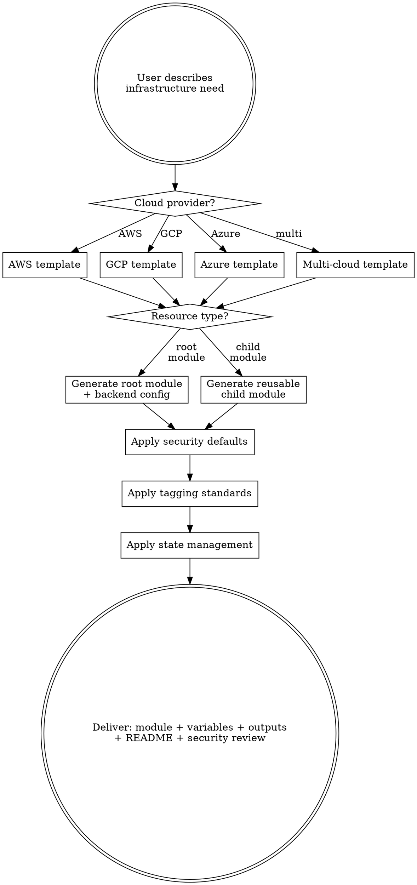

# Terraform Module Generator

## Overview

This skill generates production-grade Terraform modules. It doesn't just produce valid HCL —
it encodes remote state management, provider version pinning, least-privilege IAM, resource
tagging, module composition patterns, and state isolation that prevent infrastructure drift
and security incidents.

---

## Decision Flow



---

## Quick Reference

| Provider | Backend | State locking | Secrets | Auth method |
|----------|---------|--------------|---------|-------------|
| AWS | S3 + DynamoDB | DynamoDB | AWS Secrets Manager / SSM | OIDC (CI) or IAM role |
| GCP | GCS bucket | GCS (native) | Secret Manager | Workload Identity Federation |
| Azure | Storage Account | Storage Account (native) | Key Vault | Workload Identity Federation |

| Pattern | When to use | Directory structure |
|---------|------------|-------------------|
| Root module | Per-environment deployment | `terraform/environments/{dev,staging,prod}/` |
| Child module | Reusable component (VPC, RDS, EKS) | `terraform/modules/{vpc,rds,eks}/` |
| Module composition | Combining modules with data sources | Root calls child modules with env-specific vars |
| Terragrunt wrapper | DRY configs, multi-account | `terragrunt.hcl` per environment |

---

## Workflow: Generating Terraform

### Step 1 — Gather Context

**Required:**
- Cloud provider(s): AWS / GCP / Azure
- Resource type(s): VPC, EKS, RDS, S3, Lambda, Cloud Run, AKS, etc.
- Environment: dev / staging / prod, or multi-account setup

**Infer from context, ask only if ambiguous:**
- Region(s) — default: us-east-1 / us-central1 / eastus
- Module type: root module (per-environment) vs child module (reusable)
- State management: remote backend (S3+GCS+Azure Storage) or Terraform Cloud
- Existing infrastructure to reference via data sources

**Optional enhancements (offer proactively):**
- Terragrunt wrapper for DRY multi-environment configs
- Terraform Cloud workspace configuration
- OPA / Sentinel policy for compliance
- Cost estimation annotation (Infracost)
- `check` blocks for resource validation (Terraform 1.5+)
- Import blocks for existing resources (Terraform 1.5+)

### Step 2 — Select Module Pattern

| Use case | Pattern | Example |
|----------|---------|---------|
| Single environment, simple infra | Flat root module | `main.tf` + `variables.tf` + `outputs.tf` |
| Multi-environment | Root per env + shared child modules | `environments/prod/main.tf` calls `modules/vpc` |
| Multi-account (AWS Organizations) | Per-account state + assume-role | Separate backend per account |
| Reusable component | Child module with flexible variables | `modules/rds/main.tf` with `var.instance_class` |

### Step 3 — Generate with Best Practices

Every generated module MUST inject rules from the sections below.

---

## State Management (Enforced)

### Remote Backend

```hcl
# NEVER use local state — always configure remote backend
terraform {
  # Provider versions PINNED (not >=)
  required_version = "~> 1.7"

  required_providers {
    aws = {
      source  = "hashicorp/aws"
      version = "~> 5.40"
    }
  }

  backend "s3" {
    bucket         = "terraform-state-${var.account_id}"
    key            = "env:/${var.environment}/${var.component}/terraform.tfstate"
    region         = "us-east-1"
    dynamodb_table = "terraform-locks"
    encrypt        = true
    # NEVER hardcode credentials — use environment or IAM role
  }
}
```

### State Isolation by Environment

```
terraform-state-bucket/
├── env:/dev/vpc/terraform.tfstate
├── env:/dev/rds/terraform.tfstate
├── env:/staging/vpc/terraform.tfstate
├── env:/staging/rds/terraform.tfstate
├── env:/prod/vpc/terraform.tfstate
└── env:/prod/rds/terraform.tfstate
```

**Key prefix convention:** `env:/<environment>/<component>/terraform.tfstate`

---

## Security (Enforced in Every Module)

### 1. Least Privilege IAM

```hcl
# ❌ BAD — wildcard permissions
data "aws_iam_policy_document" "bad" {
  statement {
    actions   = ["*"]
    resources = ["*"]
    effect    = "Allow"
  }
}

# ✅ GOOD — specific actions, specific resources, with conditions
data "aws_iam_policy_document" "good" {
  statement {
    effect = "Allow"
    actions = [
      "s3:GetObject",
      "s3:ListBucket",
    ]
    resources = [
      aws_s3_bucket.data.arn,
      "${aws_s3_bucket.data.arn}/*",
    ]
    condition {
      test     = "StringEquals"
      variable = "aws:PrincipalTag/Environment"
      values   = [var.environment]
    }
  }
}
```

### 2. Security Group / Firewall Rules

```hcl
# ❌ BAD — 0.0.0.0/0 to everything
resource "aws_security_group_rule" "bad" {
  cidr_blocks = ["0.0.0.0/0"]
  from_port   = 0
  to_port     = 65535
  protocol    = "-1"
}

# ✅ GOOD — restrict to specific sources and ports
resource "aws_security_group_rule" "good" {
  type              = "ingress"
  from_port         = 443
  to_port           = 443
  protocol          = "tcp"
  cidr_blocks       = []                     # Explicitly empty — use source_security_group_id instead
  source_security_group_id = aws_security_group.alb.id
  security_group_id = aws_security_group.app.id
}
```

### 3. Database Encryption at Rest

```hcl
# Always enable:
resource "aws_db_instance" "main" {
  storage_encrypted               = true
  kms_key_id                      = var.kms_key_arn
  enabled_cloudwatch_logs_exports = ["error", "general", "slowquery"] # Postgres also: "postgresql"
  backup_retention_period         = 30
  deletion_protection             = var.environment == "prod" ? true : false
  skip_final_snapshot             = false
  copy_tags_to_snapshot           = true
}
```

### 4. S3 Bucket Security

```hcl
resource "aws_s3_bucket" "main" {
  bucket = var.bucket_name
}

resource "aws_s3_bucket_public_access_block" "main" {
  bucket                  = aws_s3_bucket.main.id
  block_public_acls       = true
  block_public_policy     = true
  ignore_public_acls      = true
  restrict_public_buckets = true
}

resource "aws_s3_bucket_versioning" "main" {
  bucket = aws_s3_bucket.main.id
  versioning_configuration {
    status = "Enabled"
  }
}

resource "aws_s3_bucket_server_side_encryption_configuration" "main" {
  bucket = aws_s3_bucket.main.id
  rule {
    apply_server_side_encryption_by_default {
      sse_algorithm     = "aws:kms"
      kms_master_key_id = var.kms_key_arn
    }
  }
}

resource "aws_s3_bucket_logging" "main" {
  bucket        = aws_s3_bucket.main.id
  target_bucket = var.log_bucket_name
  target_prefix = "s3/${aws_s3_bucket.main.id}/"
}
```

---

## Module Structure

### Root Module (per environment)

```
terraform/environments/prod/
├── main.tf           # Provider config, backend, calls child modules
├── variables.tf      # Environment-specific variables
├── outputs.tf        # Environment outputs
├── terraform.tfvars  # Variable values for this env (DON'T commit if sensitive)
└── versions.tf       # Provider and Terraform version constraints
```

### Child Module (reusable)

```
terraform/modules/vpc/
├── main.tf           # Module resources
├── variables.tf      # Input variables (with types, defaults, validation)
├── outputs.tf        # Output values
├── versions.tf       # Required provider versions for this module
└── README.md         # Usage examples, input/output reference
```

### Root Module Example

```hcl
# terraform/environments/prod/main.tf
terraform {
  required_version = "~> 1.7"

  required_providers {
    aws = {
      source  = "hashicorp/aws"
      version = "~> 5.40"
    }
  }

  backend "s3" {
    bucket         = "tf-state-123456789"
    key            = "env:/prod/platform/terraform.tfstate"
    region         = "us-east-1"
    dynamodb_table = "terraform-locks"
    encrypt        = true
  }
}

provider "aws" {
  region = var.region

  default_tags {
    tags = var.default_tags
  }
}

module "vpc" {
  source = "../../modules/vpc"

  environment = "prod"
  cidr_block  = "10.1.0.0/16"
  az_count    = 3
}

module "eks" {
  source = "../../modules/eks"

  environment     = "prod"
  cluster_version = "1.29"
  vpc_id          = module.vpc.vpc_id
  subnet_ids      = module.vpc.private_subnet_ids
}
```

### Child Module Example (VPC)

```hcl
# modules/vpc/variables.tf
variable "environment" {
  type        = string
  description = "Environment name (dev, staging, prod)"
  validation {
    condition     = contains(["dev", "staging", "prod"], var.environment)
    error_message = "Environment must be one of: dev, staging, prod."
  }
}

variable "cidr_block" {
  type        = string
  description = "VPC CIDR block"
  default     = "10.0.0.0/16"
}

variable "az_count" {
  type        = number
  description = "Number of availability zones"
  default     = 3
  validation {
    condition     = var.az_count >= 2
    error_message = "Must use at least 2 AZs for HA."
  }
}

# modules/vpc/outputs.tf
output "vpc_id" {
  description = "VPC ID"
  value       = aws_vpc.main.id
}

output "private_subnet_ids" {
  description = "Private subnet IDs"
  value       = aws_subnet.private[*].id
}

output "public_subnet_ids" {
  description = "Public subnet IDs"
  value       = aws_subnet.public[*].id
}
```

---

## Provider-Specific Templates

### AWS — EKS Cluster Module

```hcl
resource "aws_eks_cluster" "main" {
  name     = "${var.environment}-${var.cluster_name}"
  role_arn = aws_iam_role.eks_cluster.arn
  version  = var.cluster_version

  vpc_config {
    subnet_ids              = var.private_subnet_ids
    endpoint_private_access = true                   # API server accessible only within VPC
    endpoint_public_access  = var.environment != "prod" # Public only for non-prod
  }

  encryption_config {
    provider {
      key_arn = var.kms_key_arn
    }
    resources = ["secrets"]
  }

  enabled_cluster_log_types = ["api", "audit", "authenticator", "controllerManager", "scheduler"]

  depends_on = [aws_iam_role_policy_attachment.eks_cluster_policy]
}

resource "aws_eks_node_group" "main" {
  cluster_name    = aws_eks_cluster.main.name
  node_group_name = "${var.environment}-default"
  node_role_arn   = aws_iam_role.eks_node.arn
  subnet_ids      = var.private_subnet_ids

  scaling_config {
    desired_size = var.node_desired
    max_size     = var.node_max
    min_size     = var.node_min
  }

  instance_types = [var.node_instance_type]

  # Use custom launch template for Bottlerocket or custom AMI
  # launch_template { ... }

  tags = merge(var.default_tags, {
    "k8s.io/cluster-autoscaler/${aws_eks_cluster.main.name}" = "owned"
    "k8s.io/cluster-autoscaler/enabled"                      = "true"
  })
}
```

### GCP — Cloud Run Service

```hcl
resource "google_cloud_run_v2_service" "main" {
  name     = "${var.environment}-${var.service_name}"
  location = var.region
  ingress  = "INGRESS_TRAFFIC_INTERNAL_LOAD_BALANCER"

  template {
    service_account = google_service_account.service.email

    containers {
      image = "${var.registry}/${var.image_name}:${var.image_tag}"

      resources {
        limits = {
          cpu    = var.cpu_limit
          memory = var.memory_limit
        }
      }

      env {
        name  = "APP_ENV"
        value = var.environment
      }

      dynamic "env" {
        for_each = var.secret_refs
        content {
          name  = env.value["name"]
          value_source {
            secret_key_ref {
              secret  = env.value["secret_id"]
              version = "latest"
            }
          }
        }
      }

      startup_probe {
        http_get {
          path = "/healthz"
        }
      }

      liveness_probe {
        http_get {
          path = "/healthz"
        }
      }
    }

    scaling {
      min_instance_count = var.min_instances
      max_instance_count = var.max_instances
    }
  }
}
```

### Azure — AKS Cluster

```hcl
resource "azurerm_kubernetes_cluster" "main" {
  name                = "${var.environment}-${var.cluster_name}"
  location            = var.location
  resource_group_name = var.resource_group_name
  dns_prefix          = "${var.environment}-${var.cluster_name}"
  kubernetes_version  = var.kubernetes_version

  default_node_pool {
    name                = "default"
    node_count          = var.node_count
    vm_size             = var.node_vm_size
    vnet_subnet_id      = var.subnet_id
    enable_auto_scaling = true
    min_count           = var.node_min
    max_count           = var.node_max
  }

  identity {
    type = "UserAssigned"
    identity_ids = [azurerm_user_assigned_identity.eks.id]
  }

  azure_active_directory_role_based_access_control {
    managed            = true
    azure_rbac_enabled = true
  }

  oms_agent {
    log_analytics_workspace_id = var.log_analytics_workspace_id
  }

  key_vault_secrets_provider {
    secret_rotation_enabled  = true
    secret_rotation_interval = "2m"
  }

  network_profile {
    network_plugin     = "azure"
    network_policy     = "calico"
    service_cidr       = "10.100.0.0/16"
    dns_service_ip     = "10.100.0.10"
    load_balancer_sku  = "standard"
    outbound_type      = "userDefinedRouting"
  }
}
```

---

## Variable Conventions (Enforced)

```hcl
# Every variable must have:
# 1. type (never use 'any' without good reason)
# 2. description
# 3. sensible default OR required marker
# 4. validation block for constrained values

variable "environment" {
  type        = string
  description = "Deployment environment"
  validation {
    condition     = can(regex("^(dev|staging|prod)$", var.environment))
    error_message = "Environment must be dev, staging, or prod."
  }
}

variable "instance_count" {
  type        = number
  description = "Number of instances"
  default     = 3
  validation {
    condition     = var.instance_count >= 2
    error_message = "At least 2 instances required for HA."
  }
}

# Use nullable for optional resources
variable "kms_key_arn" {
  type        = string
  description = "KMS key ARN for encryption. If null, AWS-managed key is used."
  default     = null
}

# Sensitive variables
variable "db_password" {
  type        = string
  description = "Database password"
  sensitive   = true
  # NO default — must be provided explicitly
}
```

---

## Tagging Standards (Enforced)

```hcl
# Default tags applied to all resources
variable "default_tags" {
  type = map(string)
  description = "Tags applied to all taggable resources"
  default = {
    Environment = "dev"
    ManagedBy   = "terraform"
    Repository  = "github.com/org/repo"
  }
}

# ALWAYS use default_tags on the provider block (AWS/GCP/Azure all support it)
provider "aws" {
  region = var.region
  default_tags {
    tags = var.default_tags
  }
}
```

**Required tags (all providers):**
- `Environment` — dev / staging / prod
- `ManagedBy` — terraform
- `Repository` — GitHub/GitLab URL for infra code
- `Component` — resource type shorthand (vpc, eks, rds)

---

## Common Mistakes & Troubleshooting

**"State is locked" error**
→ Someone else is running `terraform apply`. Check the lock table (DynamoDB for AWS, GCS metadata for GCP). If the lock is stale, use `terraform force-unlock <LOCK_ID>` after confirming no one is actively applying.

**"Provider version mismatch"**
→ Pin versions with `~>` not `>=`. Check lock file: `terraform providers lock -platform=linux_amd64 -platform=darwin_amd64` should be committed to git.

**"Resource not found during refresh"**
→ Resource was deleted outside Terraform (click-ops). Either re-import with `terraform import` or remove from state with `terraform state rm`. Then decide: recreate or remove from config.

**"S3 bucket already exists"**
→ Bucket names are globally unique. If you're re-creating a deleted bucket, wait (S3 has eventual consistency on bucket name release). Better: add a random suffix or use account ID in name.

**"Sensitive values in plan output"**
→ Variables marked `sensitive = true` won't print, but plan may show diffs on sensitive values. Set `sensitive = true` on outputs too. Use `terraform plan -out=plan.out` and `terraform apply plan.out` for CI.

**"IAM role not assuming"**
→ Check trust relationship (`assume_role_policy`). For OIDC, verify the `Federated` principal and condition match the OIDC provider URL and subject claim.

---

## Output Format

When delivering, always provide:

### 1. Module Files
All `.tf` files in the correct directory structure.

### 2. Security Review Table

| Check | Status | Notes |
|-------|--------|-------|
| Remote state with encryption | PASS | S3 + DynamoDB with SSE |
| State per environment | PASS | `env:/{env}/{component}` key prefix |
| Provider versions pinned | PASS | `~>` constraints, lock file committed |
| Least privilege IAM | PASS | No wildcard actions/resources |
| Encryption at rest | PASS | All data stores KMS-encrypted |
| S3 public access blocked | PASS | All 4 block settings enabled |
| Security groups restricted | PASS | No 0.0.0.0/0 unless CDN/ALB |
| Sensitive variables marked | PASS | DB passwords, API keys all `sensitive = true` |
| Deletion protection (prod) | PASS | RDS, DynamoDB tables prevent accidental delete |

### 3. Usage Instructions

```bash
# Initialize
terraform init

# Plan (save output for CI)
terraform plan -out=plan.out

# Apply
terraform apply plan.out

# For new developers:
# Copy terraform.tfvars.example → terraform.tfvars
# Fill in required variables
# Run terraform init && terraform plan
```
